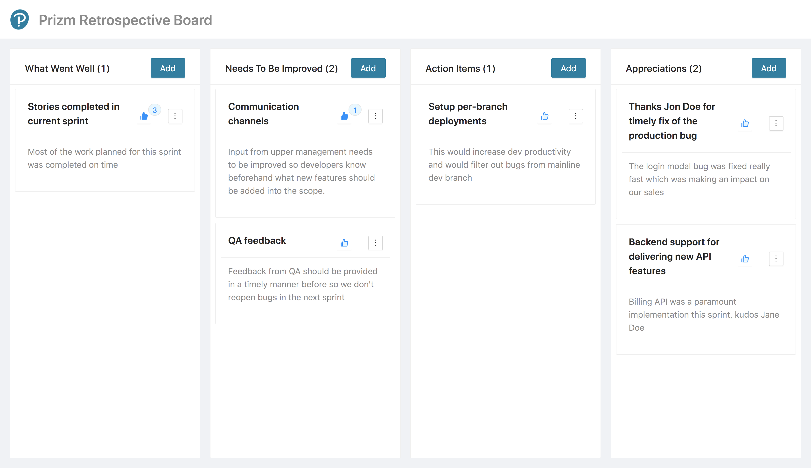

# Prizm Retrospective Board

A taskboard application for teams.
Live demo is **[here](https://ysrg.github.io/retrospective-board/)**.

## Tech Stack

- Language: [TypeScript](https://www.typescriptlang.org/)
- UI-Components: [Ant Design](https://ant.design/)
- Styling: [styled-components](https://styled-components.com/)
- Linting: [ESLint](https://eslint.org/)
- Code Formatting: [Prettier](https://prettier.io/)
- Deployment: [GitHub Actions](https://github.com/features/actions)
- Hosting: [GitHub Pages](https://pages.github.com/)

## Features

🖋 Create, edit & delete tasks
💾 Tasks are persisted to database
🚀 Automated deployments with GitHub Actions

## Development
### `npm start`

Runs the app in the development mode.\
Open [http://localhost:3000](http://localhost:3000) to view it in the browser.

### `npm run build`

Builds the app for production to the `build` folder.\
It correctly bundles React in production mode and optimizes the build for the best performance.

The build is minified and the filenames include the hashes.\
Your app is ready to be deployed!

See the section about [deployment](https://facebook.github.io/create-react-app/docs/deployment) for more information.
